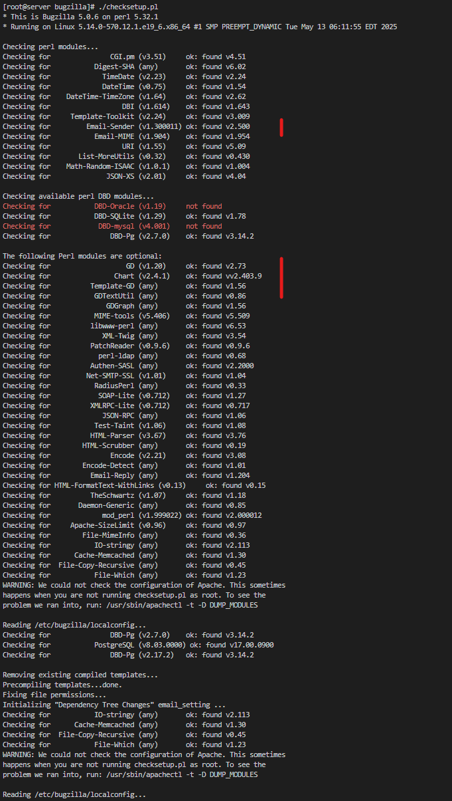
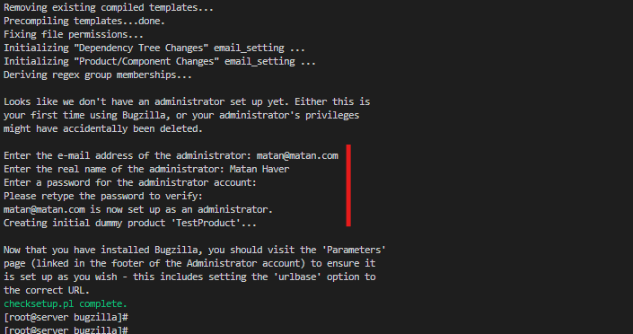
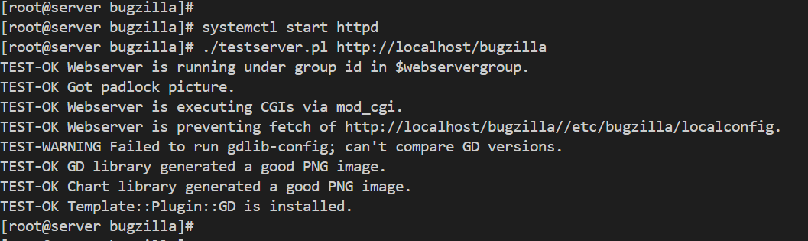
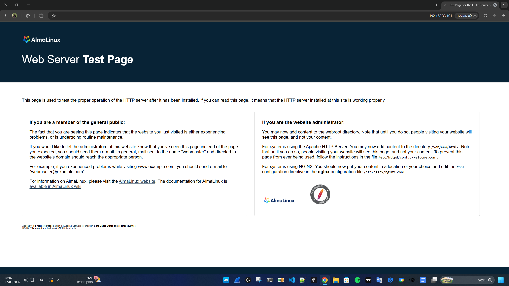
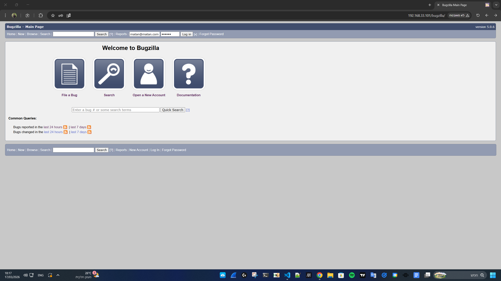
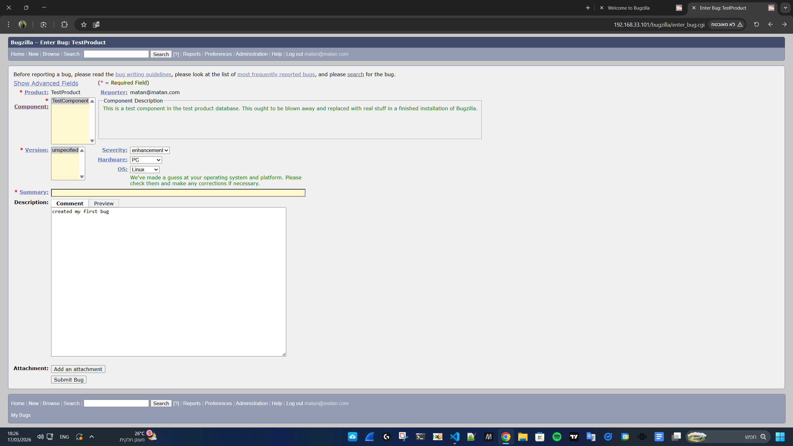
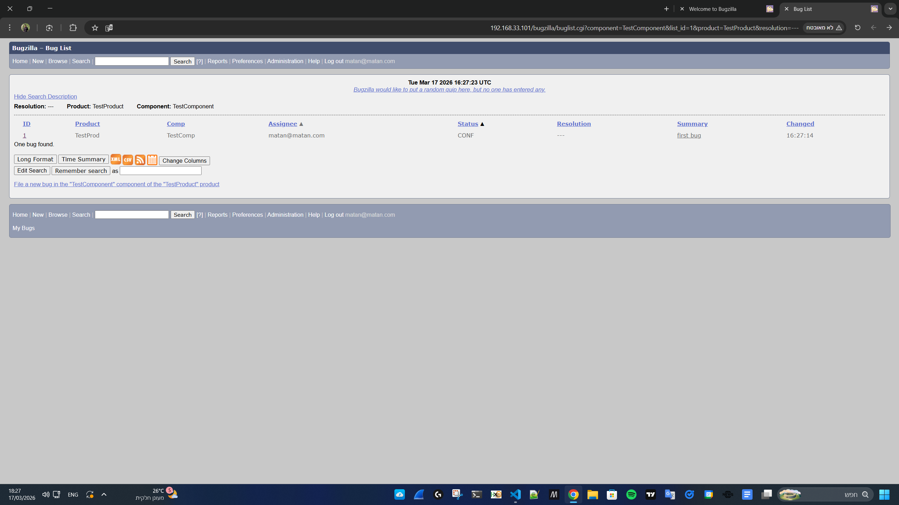
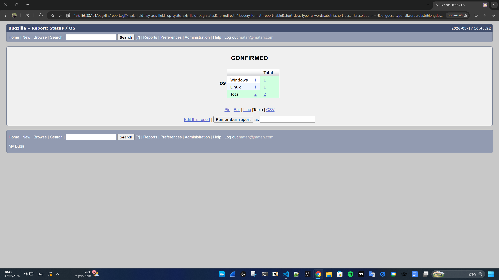
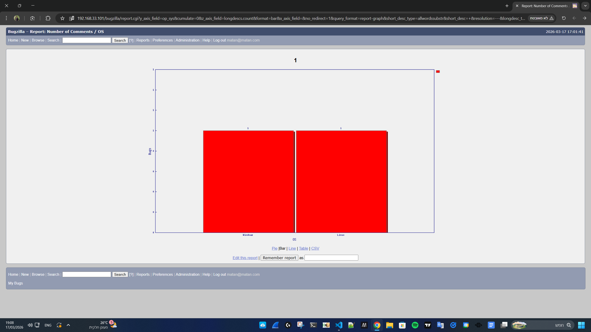

# Bugzilla by Matan Haver

## Notes

I deployed it on AlmaLinux 9 which is an open-source Linux distribution which I familiar with.  
compatible with Red Hat Enterprise Linux (RHEL)

For the task i deployed all (db, webserver and app) on the same vm,  
even though its not considered as a best practice

vm os - AlmaLinux 9  
db - postgresql  
webserver - apache

### ℹ️ screenshots are also here and under screenshots folder

## I used the following guides

https://bugzilla.readthedocs.io/en/latest/installing/linux.html

db configure - https://bugzilla.readthedocs.io/en/latest/installing/postgresql.html#add-a-user  
apache configure - https://bugzilla.readthedocs.io/en/latest/installing/apache.html#apache

The vm is deployed using vagrant with virtual box, which automate the process  
The steps I run to configure the vm is under `config/init.sh`  
The script runs only for the first time when the vm is created

## after ssh into vm, here steps I did manually

```bash
sudo su -
cd /usr/share/bugzilla
./checksetup.pl
dnf install -y "perl(DBD::Pg)"

# edit conf file to configure db
vi /etc/bugzilla/localconfig

./install-module.pl --all

./checksetup.pl
# install optional modules (like chart)
dnf install -y "perl(GD)" gd-devel graphviz patchutils

./checksetup.pl
```

### setup and perl modules installation (include chart and email)

  
o  
o  
o  


```bash
systemctl enable httpd
systemctl start httpd

./testserver.pl http://localhost/bugzilla
```



## configuration files I edited

### ℹ️ full files appears in this repo

- pg_hba.conf => for db authentication under `/var/lib/pgsql/17/data/pg_hba.conf`  
  allows user bugs to access all dbs from localhost only using password authentication  
  add the following and run `sudo systemctl reload postgresql-17`

```
host    all             bugs            127.0.0.1/32          scram-sha-256
host    all             bugs            ::1/128              	scram-sha-256
```

- localconfig => set db connection `/etc/bugzilla/localconfig`  
  Set driver to use postgresql

Changed the following

```
$db_driver = 'Pg';
$db_pass = 'bugs_pass';
```

- apache (httpd)  
  The package installation extends the apache configuration under `/etc/httpd/conf.d/bugzilla.conf`

```
Alias /var/lib/bugzilla/data/webdot /var/lib/bugzilla/data/webdot
Alias /bugzilla /usr/share/bugzilla

<Directory /usr/share/bugzilla>

  <IfModule mod_authz_core.c>
    # Bugzilla will be accessible to all machines in your network
    # Replace with "Require local" if you want access to be restricted
    # to this machine.
    Require all granted
  </IfModule>

  AddHandler cgi-script .cgi
  Options +Indexes +ExecCGI +FollowSymLinks
  DirectoryIndex index.cgi index.html
  AllowOverride Limit Options FileInfo Indexes AuthConfig
  AddType application/vnd.mozilla.xul+xml .xul
  AddType application/rdf+xml .rdf
</Directory>

<Directory /var/lib/bugzilla/data/webdot>
  Require all granted
</Directory>
```

# Results from the browser

### apache test page `http://192.168.33.101/`



### bugzilla home page `http://192.168.33.101/bugzilla`



### submit a bug





### reports



#### bar chart - bugs by os


